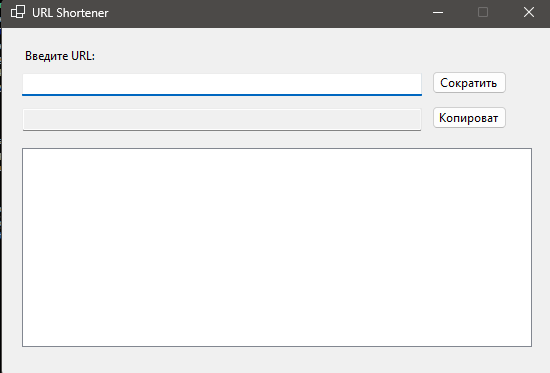

# URL Shortener (WinForms)
---
- Приложение для сокращения длинных ссылок через сервис [is.gd](https://is.gd/)
---
- An application for shortening long links through the service [is.gd](https://is.gd/)
---
## О приложении:
- Вводить длинный URL
- Получать короткую ссылку
- Копировать короткую ссылку в буфер
- Хранить историю сокращений в локальном файле
---
## About the app:
- Enter a long URL
- Receive a short link
- Copy the short link to the clipboard
- Store the history of abbreviations in a local file
---
## Возможности
- Сокращение ссылок одним кликом
- История всех сокращенных ссылок
- Копирование короткой ссылки в буфер
- Автоматическое сохранение истории между запусками приложения
---
## Features
- Shortening links with one click
- History of all abbreviated links
- Copy the short link to the buffer
- Automatic history saving between app launches
---
## Установка и запуск
1. Клонируйте репозиторий.
2. Откройте решение в Visual Studio
3. Соберите проект и запустите
4. Введите длинный URL и нажмите "Сократить"
5. Короткая ссылка появится в поле ниже
6. Можно скопировать её кнопкой "Копировать"
7. История отображается в нижнем списке
---
## Installation and launch
1. Clone the repository.
2. Open the solution in Visual Studio
3. Assemble the project and run
4. Enter a long URL and click "Shorten"
5. A short link will appear in the field below
6. You can copy it with the "Copy" button
7. The history is displayed in the bottom list.
---
## Примечания
- История сокращений хранится в файле `history.json`
- Для работы требуется подключение к интернету
- Сервис сокращения использует API `https://is.gd`
---
## Notes
- The history of abbreviations is stored in the `history' file.json`
- An internet connection is required for operation
- The abbreviation service uses the API `https://is.gd`
---

---